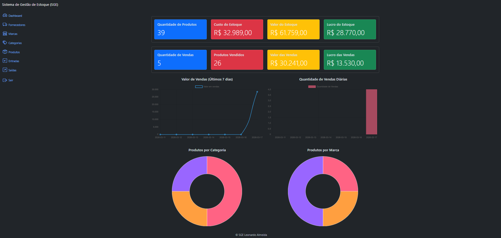
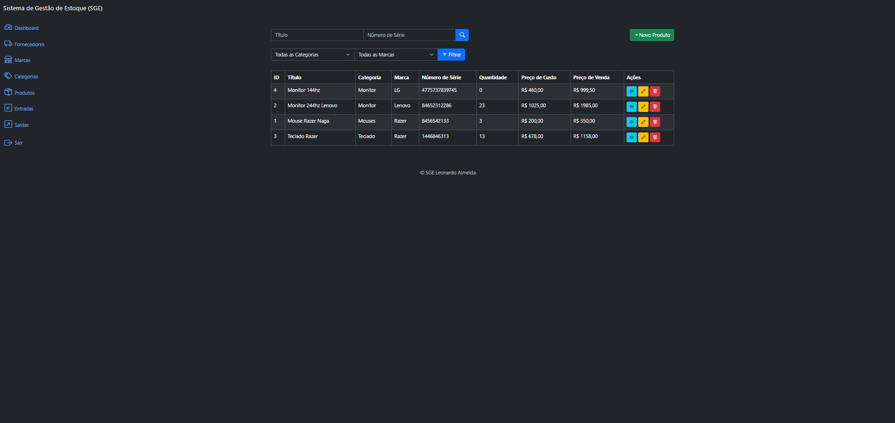
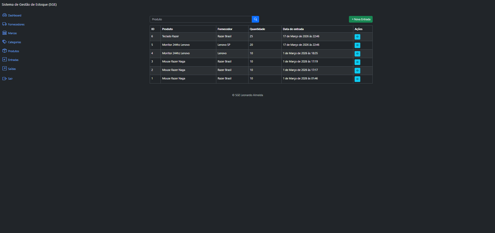
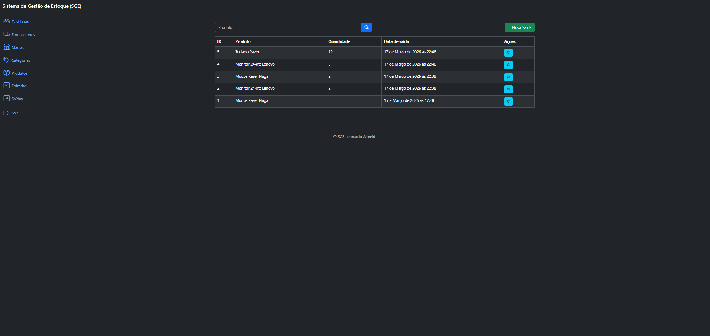
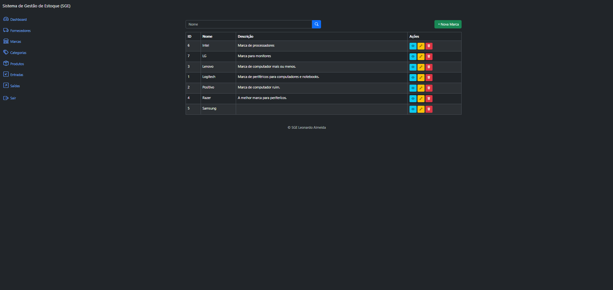
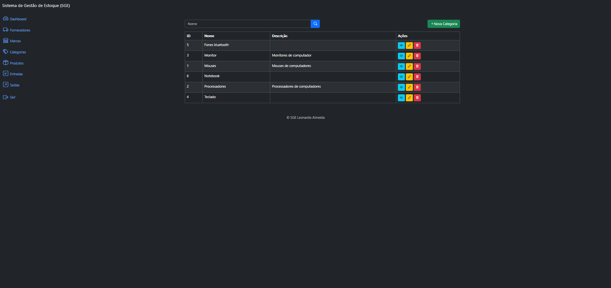
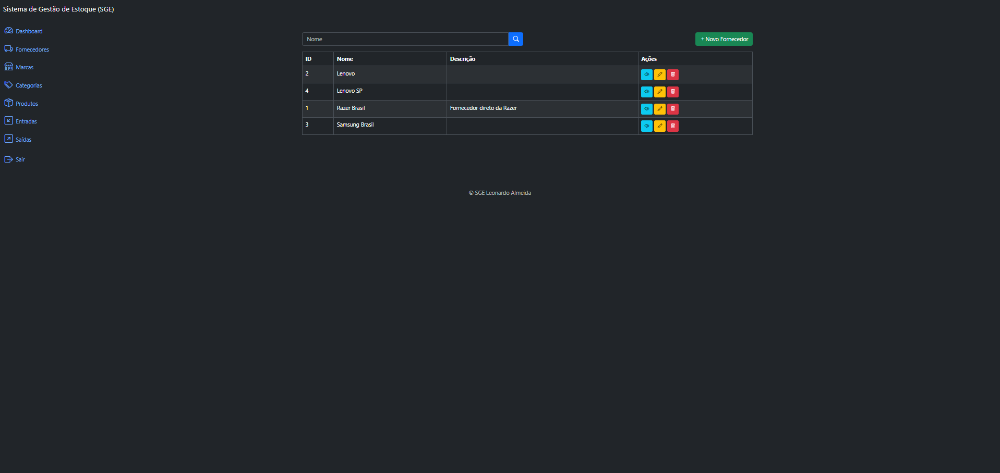

# SGE — Sistema de Gestão de Estoque

Sistema web completo para gestão de estoque desenvolvido com Django e Django REST Framework. Permite controlar entradas e saídas de produtos, gerenciar fornecedores, marcas e categorias, além de visualizar métricas e gráficos em tempo real no dashboard.

## 🚀 Tecnologias

- Python 3.x
- Django 5.x
- Django REST Framework
- SimpleJWT
- SQLite
- Bootstrap 5
- HTML e CSS

## ✅ Funcionalidades

- Dashboard com métricas de estoque e vendas em tempo real
- Gráficos de vendas diárias por valor e por quantidade
- Gráficos de distribuição de produtos por categoria e por marca
- Cadastro completo de produtos com preço de custo, preço de venda e número de série
- Gestão de marcas, categorias e fornecedores
- Registro de entradas de estoque vinculadas a fornecedores
- Registro de saídas com validação automática de estoque disponível
- Atualização automática da quantidade em estoque via Django Signals
- API REST completa com autenticação JWT
- Sistema de permissões granular por operação (visualizar, criar, editar, deletar)
- Paginação e filtros de busca em todas as listagens

## 🔧 Como rodar o projeto localmente

**Pré-requisitos:** Python 3.x instalado

**1. Clone o repositório**
```bash
git clone https://github.com/seu-usuario/sge.git
cd sge
```

**2. Crie e ative o ambiente virtual**
```bash
python -m venv venv
source venv/bin/activate  # Linux/Mac
venv\Scripts\activate     # Windows
```
**3. Instale as dependências**
```bash
pip install -r requirements.txt
```

**4. Configure as variáveis de ambiente**

Crie um arquivo `.env` na raiz do projeto:
```bash
SECRET_KEY=cole-sua-SECRET_KEY-aqui
DEBUG=True
```

**5. Execute as migrations**
```bash
python manage.py migrate
```

**6. Crie um superusuário**
```bash
python manage.py createsuperuser
```

**7. Inicie o servidor**
```bash
python manage.py runserver
```
Acesse http://127.0.0.1:8000 no navegador.


## 🔐 Permissões e Grupos

O sistema utiliza o sistema nativo de grupos e permissões do Django.
Para liberar acesso a um usuário, acesse o painel administrativo em `/admin/`,
crie um grupo com as permissões desejadas e atribua o usuário a esse grupo.


## 📡 API REST

A API utiliza autenticação JWT. Para obter um token de acesso:
```bash
POST /api/v1/authentication/token/
Content-Type: application/json
{
  "username": "seu-usuario",
  "password": "sua-senha"
}
```

## Endpoints disponíveis

| Recurso      | Listagem / Criação          | Detalhe / Edição / Exclusão        |
|--------------|-----------------------------|------------------------------------|
| Produtos     | `/api/v1/products/`         | `/api/v1/products/<id>/`           |
| Marcas       | `/api/v1/brands/`           | `/api/v1/brands/<id>/`             |
| Categorias   | `/api/v1/categories/`       | `/api/v1/categories/<id>/`         |
| Fornecedores | `/api/v1/suppliers/`        | `/api/v1/suppliers/<id>/`          |
| Entradas     | `/api/v1/inflows/`          | `/api/v1/inflows/<id>/`            |
| Saídas       | `/api/v1/outflows/`         | `/api/v1/outflows/<id>/`           |

Para autenticar nas requisições, envie o bearer token no header.


## 📁 Estrutura do Projeto

sge/ ├── app/ # Configurações principais, settings, urls e métricas ├── authentication/ # Endpoints de autenticação JWT 
├── brands/ # Gestão de marcas ├── categories/ # Gestão de categorias ├── suppliers/ # Gestão de fornecedores 
├── products/ # Gestão de produtos ├── inflows/ # Entradas de estoque ├── outflows/ # Saídas de estoque


## 📸 Screenshots

**Dashboard**


**Produtos**


**Entradas**


**Saídas**


**Marcas**


**Categorias**


**Fornecedores**


## 👨‍💻 Autor

Leonardo — [LinkedIn](https://linkedin.com/in/leonardoalmeida-) · [GitHub](https://github.com/LeonardoAlmeidaGit)
